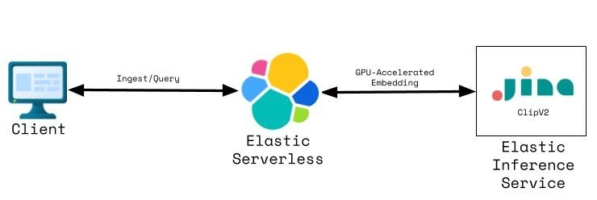
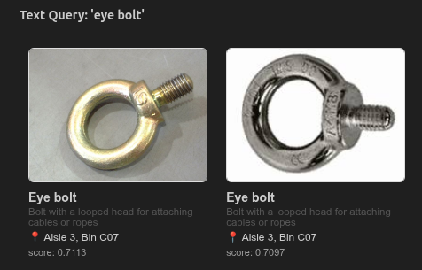

# Photo-to-Product Search: Multi-Modal Embeddings with Jina CLIP v2 on EIS
*Demonstration of Jina ClipV2 on EIS*

In this post, I demonstrate the configuration and use of the Jina ClipV2 multi-modal embedder in a hardware store use case.  This model was recently released on the [Elastic Inference Service](https://www.elastic.co/docs/explore-analyze/elastic-inference/eis) (EIS). 

## Why multi-modal embeddings?
In this scenario, a customer can provide a photo or describe what they're looking for in plain English, and be matched to the right product and location in the store.  That's the value of a shared embedding space for text and images. 

---

## What This Article Covers

- Provisioning an [Elastic Serverless](https://www.elastic.co/cloud/serverless) project via Terraform.
- Generating a synthetic product catalog of hardware (fasteners) that includes images and textual information.
- Indexing that product catalog in Elasticsearch.
- Generating multi-modal embeddings of the product images via [Jina ClipV2](https://jina.ai/news/jina-clip-v2-multilingual-multimodal-embeddings-for-text-and-images/).
- Performing product catalog searches via image and text.

---

## Architecture



I deploy an Elastic Serverless project via Terraform for this demo.  The Jina ClipV2 inference endpoint on EIS is configured by default on that Serverless project.  That endpoint is used for all image and text embedding tasks.

---

## Creating the Product Catalog

I make use of Wikimedia images of various hardware fasteners.  These images along with synthetic product information and store aisle-level locations are composed in a CSV file. 

There are two methods for submitting images to EIS for embedding via jina-clip-v2:  base64-encoded or URL.  Below are examples of each.

### Image Embedding of Local Files (Base64 encoding)
The embedding calls use exponential backoff via tenacity to handle rate limiting (HTTP 429) from EIS — a small but important detail for production workloads.  Another caveat - Wikimedia also rate limits access to their content.

```python
def image_to_base64(path: str) -> str:
    with open(path, "rb") as f:
        return base64.b64encode(f.read()).decode()

@retry(retry=retry_if_exception(is_retryable), stop=stop_after_attempt(6), wait=wait_exponential_jitter(initial=1, max=30), reraise=True)
def get_image_embedding(img_b64: str, mime: str = "image/jpg") -> list:
    resp = es.inference.inference(
        inference_id=".jina-clip-v2",
        body={"input_type": "INGEST","input": [{"content": {"type": "image", "format": "base64", "value": f"data:{mime};base64,{img_b64}"}}]},
    )
    return resp["embeddings"][0]["embedding"]

embedding = get_image_embedding(image_to_base64(str(img_path)), mime)
```

### Image Embedding via URL
```python
@retry(retry=retry_if_exception(is_retryable_url), stop=stop_after_attempt(6), wait=wait_exponential_jitter(initial=1, max=30), reraise=True)
def get_image_embedding_by_url(url: str) -> list:
    resp = es.inference.inference(
        inference_id=".jina-clip-v2",
        body={"input_type": "INGEST","input": [{"content": {"type": "image", "value": url}}]},
    )
    return resp["embeddings"][0]["embedding"]
```

---
## Image Search
I include a sample search where one of the catalog images is used to find the most similar products to that given image via an Elastic vector search.
```python
query_image_path = "images/wing_nut_1.jpg"
print(f"Query image: {query_image_path}")

ext = query_image_path.rsplit(".", 1)[-1].lower()
mime = "image/jpg" if ext in ("jpg", "jpeg") else f"image/{ext}"
embedding = get_image_embedding(image_to_base64(query_image_path), mime)

hits = es.search(
    index=INDEX,
    knn={"field": "embedding", "query_vector": embedding, "k": 3, "num_candidates": 20},
    source=["name", "description", "aisle", "bin", "image_path"],
)["hits"]["hits"]
```
---


## Text Search
I demonstrate the multi-modal capabilities of Jina ClipV2 via a textual vector search against the image vectors in the catalog index.  Note that the text query "eye bolt" is being compared directly against image embeddings — the model itself has no text descriptions of these images to fall back on. It's matching the meaning of the words to the visual content of the photos.

```python
query_text = "eye bolt" 
print(f"Query: '{query_text}'\n")

embedding = get_text_embedding(query_text)

hits = es.search(
    index=INDEX,
    knn={"field": "embedding", "query_vector": embedding, "k": 2, "num_candidates": 20},
    source=["name", "description", "aisle", "bin", "image_path"],
)["hits"]["hits"]
```


---

## Conclusion
This demo covers basic usage of Jina ClipV2, but there are far more capabilities that could be exploited for this use case.  Examples:  filtering by product alongside vector similarity or using the hybrid search functionality of Elasticsearch to combine lexical and vector results.

## Source Code

The full source is available here:

https://github.com/joeywhelan/clip-demo

---